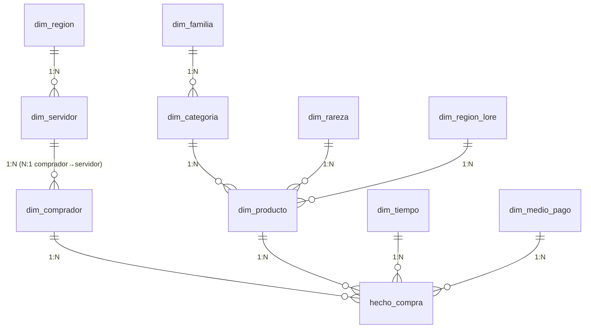

# Hextech Bazaar — Modelo de Datos (Esquema Snowflake)

> Actividad Formativa N.º 2 — Algoritmos y Estructuras de Datos (UTN-FRRe, ISI 2026)
> Aplicación de los conceptos de **registro** y **clave** de la **Unidad 2**.

## 1. El e-commerce

**Hextech Bazaar** es un *Fantasy Shop* (Opción 5) temático del videojuego **League of Legends**.
Es un mercado del universo de **Runeterra** que vende dos **familias** de productos:

- **Coleccionables** — *campeones* y *aspectos (skins)*, comprables con **RP**.
- **Equipo** — *ítems de juego* de la Grieta del Invocador (ataque, magia, defensa, botas), comprables con **oro**.

Los datos e imágenes de los productos son **oficiales del juego** League of Legends. El sitio es
**funcional a nivel de navegación** (portada, catálogo con filtros, detalle de producto, carrito) y
**no procesa pagos reales**: es un modelo académico para demostrar los conceptos de registro y clave.

## 2. Por qué un esquema *snowflake* (copo de nieve)

El modelo dimensional tiene una **tabla de hechos** central (`hecho_compra`) rodeada de **dimensiones**.
A diferencia del *star schema*, aquí las dimensiones están **normalizadas en sub-dimensiones
encadenadas**, formando las "ramas" del copo:

- **Rama producto:** `dim_producto → dim_categoria → dim_familia`
- **Rama comprador:** `dim_comprador → dim_servidor → dim_region`

Esa normalización en cadena es exactamente lo que distingue al snowflake del star, y permite mostrar
**claves foráneas encadenadas** (una FK que apunta a una tabla que a su vez tiene otra FK).

## 3. Diagrama entidad-relación

**Centro (hechos):** `hecho_compra` — grano: *1 fila = 1 ítem (línea) de una orden de compra*.

## 4. Registro maestro: `dim_comprador` (cliente-comprador)

Es el **registro principal** pedido por la consigna. Reúne campos **heterogéneos** (texto, fecha,
enteros) que describen a la entidad "Comprador" (el *Invocador*).

### Cardinalidad clave: N:1

> **Muchos compradores pertenecen a un (1) servidor de juego.**

Se implementa con la FK `dim_comprador.id_servidor → dim_servidor.id_servidor`: un servidor tiene
muchos compradores asociados; cada comprador apunta a exactamente uno.

### Diccionario de campos del registro maestro

| Campo | Tipo de dato | Tamaño | Contenido/Continente | Rol de clave |
|---|---|---|---|---|
| `id_comprador` | Entero (autoincremental) | 4 bytes | Contenido | **PK — Primaria, Simple** |
| `email` | Cadena | 120 | Contenido | Candidata natural, Simple (UNIQUE) |
| `nick_invocador` | Cadena | 30 | Contenido | Parte del Riot ID → **clave compuesta** |
| `riot_tag` | Cadena | 8 | Contenido | Parte del Riot ID → **clave compuesta** |
| `nombre` | Cadena | 60 | Contenido | — |
| `apellido` | Cadena | 60 | Contenido | **Secundaria** (índice, ordenar/agrupar) |
| `fecha_nacimiento` | Fecha | 10 | **Continente** (Día/Mes/Año) | — |
| `fecha_alta` | Fecha | 10 | Contenido | — |
| `nivel_invocador` | Entero | 4 bytes | Contenido | — |
| `horas_jugadas` | Real | 8 bytes | Contenido | — |
| `cuenta_premium` | Booleano | 1 byte | Contenido | — |
| `id_servidor` | Entero | 4 bytes | Contenido | **FK — Foránea** → `dim_servidor` (N:1) |

> `fecha_nacimiento` ilustra el concepto de **campo continente**: internamente agrupa los subcampos
> Día, Mes y Año, accesibles con el *selector de campo* (`Registro.Campo`).
>
> Los tipos de dato se expresan en forma **conceptual** (entero, real, cadena, booleano, fecha),
> tal como los trabaja la Unidad 2. El registro incluye a propósito un campo **real**
> (`horas_jugadas`) y uno **booleano** (`cuenta_premium`) para mostrar la heterogeneidad de campos.
>
> El **Riot ID** (`nick_invocador#riot_tag`) ilustra una **clave compuesta natural**: se declara
> `UNIQUE (nick_invocador, riot_tag)`.

## 5. Justificación de la clave del registro maestro

**Clave primaria elegida: `id_comprador`** (surrogate, entera, autoincremental).

¿Por qué no usar el email o el Riot ID como clave primaria?

- El **email** es único, pero **cambia con frecuencia** (la persona migra de proveedor), lo que lo hace
  inestable como identificador permanente.
- El **Riot ID** (`nick_invocador#riot_tag`) también es único, pero es **compuesto** y el jugador
  **puede renombrarlo**, lo que obligaría a propagar el cambio a todas las tablas que lo referencian.
- `id_comprador` es **estable, compacto, nunca nulo y desacoplado del negocio**, ideal como clave
  primaria y como destino de las FK de la tabla de hechos.

Email y Riot ID se conservan como **claves candidatas** (`UNIQUE`) para garantizar la unicidad de
negocio sin ser la PK.

## 6. Todos los tipos de clave presentes en el modelo

| Tipo de clave | Definición (Unidad 2) | Ejemplo en Hextech Bazaar |
|---|---|---|
| **Primaria (PK)** | Identifica único e irrepetible | `dim_comprador.id_comprador`, todas las `id_*` |
| **Foránea (FK)** | Puente hacia otro registro/archivo | `dim_comprador.id_servidor`, `dim_categoria.id_familia` (encadenada), todas las FK de `hecho_compra` |
| **Secundaria** | No única; agrupa/ordena/busca | índices `idx_comprador_apellido`, `idx_producto_categoria`, `idx_hecho_tiempo` |
| **Simple** | Un único campo contenido | `id_comprador`, `email`, `sku`, `codigo` |
| **Compleja / compuesta** | Campo continente / varias columnas | `UNIQUE(nick_invocador, riot_tag)` (Riot ID), `hecho_compra UNIQUE(nro_orden, nro_linea)`, continente `fecha` |

## 7. Conexión con "corte de control" (Unidad 2)

La tabla `hecho_compra` está indexada por `id_tiempo` y `id_comprador` y (vía comprador) por
`id_servidor`. Si se ordena físicamente por la jerarquía **servidor → comprador**, se puede aplicar un
**corte de control** para emitir subtotales por servidor y un total general. La clave compleja de corte
sería `(id_servidor, id_comprador)`.

## 8. Artefactos

- DDL completo (snowflake, comentado por tipo de clave): [`db/schema.sql`](../db/schema.sql)
- Seed de dimensiones estáticas: [`db/seed-dimensiones.sql`](../db/seed-dimensiones.sql)
- Seed de productos (catálogo del juego): [`db/seed-productos.sql`](../db/seed-productos.sql)
