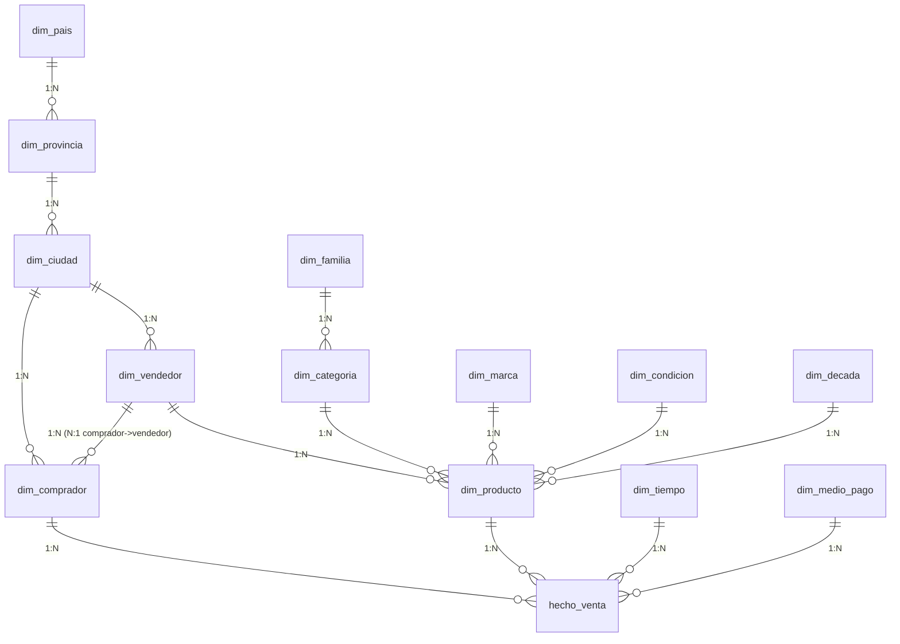

# RetroVerse — Modelo de Datos (Esquema Snowflake)

> Actividad Formativa N.º 2 — Algoritmos y Estructuras de Datos (UTN-FRRe, ISI 2026)
> Aplicación de los conceptos de **registro** y **clave** (Unidad 2).

## 1. El e-commerce
**RetroVerse** es una tienda digital de objetos vintage, coleccionables y tecnología
retro (computadoras hogareñas, consolas, walkmans, vinilos, cartuchos). Es un
**marketplace curado**: cada comprador opera asociado a una tienda/vendedor.

## 2. Por qué esquema *snowflake* (copo de nieve)
El modelo dimensional tiene una **tabla de hechos** central (`hecho_venta`) rodeada de
**dimensiones**. A diferencia del *star schema*, aquí las dimensiones están
**normalizadas en sub-dimensiones encadenadas**, formando las "ramas" del copo:

- **Producto** → `categoria` → `familia`
- **Comprador / Vendedor** → `ciudad` → `provincia` → `pais`

Esa normalización en cadena es exactamente lo que distingue al snowflake, y nos permite
mostrar **claves foráneas encadenadas** (una FK que apunta a una tabla que a su vez tiene
otra FK).

## 3. Diagrama entidad-relación

**Centro (hechos):** `hecho_venta` — grano: *1 fila = 1 ítem (línea) de un pedido*.

## 4. Registro maestro: `dim_comprador` (cliente-comprador)
Es el **registro principal** pedido por la consigna. Reúne campos **heterogéneos**
(texto, fecha, enteros) que describen a la entidad "Comprador".

### Cardinalidad clave: N:1
> **Muchos compradores compran a un (1) vendedor.**

Se implementa con la FK `dim_comprador.id_vendedor → dim_vendedor.id_vendedor`:
un vendedor tiene muchos compradores asociados; cada comprador apunta a exactamente uno.

### Diccionario de campos del registro maestro
| Campo | Tipo (SQL) | Tamaño | Contenido/Continente | Rol de clave |
|---|---|---|---|---|
| `id_comprador` | SERIAL (int) | 4 bytes | Contenido | **PK — Primaria, Simple** |
| `dni` | VARCHAR | 11 | Contenido | Candidata natural, Simple (UNIQUE) |
| `email` | VARCHAR | 120 | Contenido | Candidata natural, Simple (UNIQUE) |
| `nombre` | VARCHAR | 60 | Contenido | — |
| `apellido` | VARCHAR | 60 | Contenido | Secundaria (índice, ordenar/agrupar) |
| `fecha_nacimiento` | DATE | 4 bytes | **Continente** (Día/Mes/Año) | — |
| `fecha_alta` | DATE | 4 bytes | Contenido | — |
| `id_ciudad` | INT | 4 bytes | Contenido | **FK — Foránea** → `dim_ciudad` |
| `id_vendedor` | INT | 4 bytes | Contenido | **FK — Foránea** → `dim_vendedor` (N:1) |

> `fecha_nacimiento` ilustra el concepto de **campo continente**: internamente agrupa
> los subcampos Día, Mes y Año (la app los descompone con el selector de campo).

## 5. Justificación de la clave del registro maestro
**Clave primaria elegida: `id_comprador`** (surrogate, entera, autoincremental).

¿Por qué no usar el DNI o el email como clave primaria?
- El **DNI** es una clave candidata **natural y simple**, pero: puede no existir para
  compradores extranjeros, puede cargarse mal y su cambio obligaría a actualizar todas
  las tablas que lo referencian.
- El **email** también es único, pero **cambia con frecuencia** (la persona migra de
  proveedor), lo que lo hace inestable como identificador permanente.
- `id_comprador` es **estable, compacto, nunca nulo y desacoplado del negocio**, ideal
  como clave primaria y como destino de las FK de la fact table.

DNI y email se conservan como **claves candidatas** (`UNIQUE`) para garantizar unicidad
de negocio sin ser la PK.

## 6. Todos los tipos de clave presentes en el modelo
| Tipo de clave | Definición (Unidad 2) | Ejemplo en RetroVerse |
|---|---|---|
| **Primaria (PK)** | Identifica único e irrepetible | `dim_comprador.id_comprador`, todas las `id_*` |
| **Foránea (FK)** | Puente hacia otro registro/archivo | `dim_comprador.id_vendedor`, `dim_categoria.id_familia`, todas las FK de `hecho_venta` |
| **Secundaria** | No única; agrupa/ordena/busca | índices `idx_comprador_apellido`, `idx_producto_categoria`, `idx_hecho_tiempo` |
| **Simple** | Un único campo contenido | `dni`, `sku`, `codigo_iso` |
| **Compleja / compuesta** | Campo continente / varias columnas | `hecho_venta (nro_pedido, nro_linea)` UNIQUE |

## 7. Conexión con "corte de control" (Unidad 2)
La fact table `hecho_venta` está indexada por `id_tiempo`, `id_comprador` y
(vía comprador) por `id_vendedor`. Si se ordena físicamente por la jerarquía
**vendedor → comprador → fecha**, se puede aplicar un **corte de control** para emitir
subtotales por vendedor, por comprador y total general. La clave compleja de corte sería
`(id_vendedor, id_comprador, fecha)`.

## 8. Artefactos
- DDL completo: [`db/schema.sql`](../db/schema.sql)
- Datos de ejemplo: [`db/seed.sql`](../db/seed.sql)
